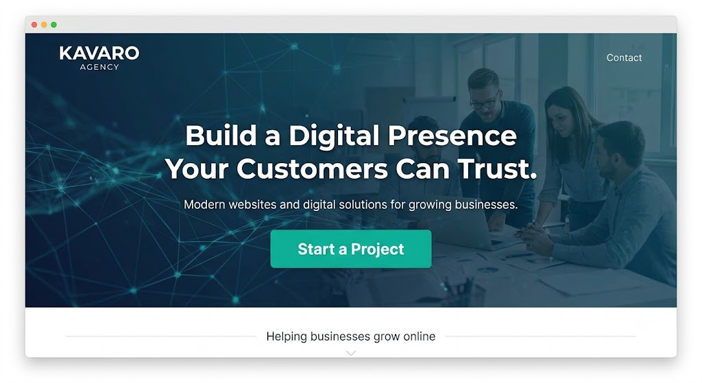

# trigger deployment
# Kavaro Agency 🌐

  

<h3 align="center">
Modern websites and digital solutions for growing businesses.
</h3>

  <a href="https://kavaro-agency-website.njogucaroline91.workers.dev/">
    Live Website
  </a>

---

## 🚀 About Kavaro

Kavaro is a remote web development agency building modern websites, web applications, and digital solutions for growing businesses.

We help businesses establish their online presence through **custom website development, user-focused design, and practical digital tools** that make it easier for customers to discover, interact with, and trust their services.

From business websites and landing pages to booking systems, dashboards, and AI-enhanced solutions, Kavaro combines technology and design thinking to build digital experiences that solve real problems.

---

## 💡 Our Story

Many businesses provide valuable services but struggle because they lack a strong digital presence.

Kavaro was created to help close that gap — giving businesses the digital tools they need to be discovered, serve customers better, and grow online.

We believe every business deserves a digital experience that works.

---

# 🛠️ What We Build

## 🌐 Business Websites

Modern, responsive websites that help businesses:

- Showcase their services
- Build customer trust
- Improve online visibility
- Generate inquiries and leads

---

## ⚡ Web Applications

Custom-built platforms designed around specific business needs:

- Dashboards
- Customer portals
- Internal tools
- Management systems

---

## 📅 Booking & Customer Systems

Digital solutions that make customer interactions easier:

- Appointment booking
- Service requests
- Customer management
- Online workflows

---

## 🎨 UI/UX Design

Every product starts with understanding users.

Our design process includes:

- User research
- Wireframes
- Prototypes
- Design systems
- Responsive interfaces

---

## 🤖 AI-Powered Solutions

We integrate practical AI capabilities where they create real value:

- AI assistants
- Smart workflows
- Automation
- Intelligent digital experiences

---

# 🧰 Technology Stack

## Frontend

- React
- TypeScript
- Vite
- Tailwind CSS
- Responsive Web Design

## Backend

- Node.js
- Express.js
- Prisma
- PostgreSQL

## Design

- Figma
- UI/UX Design
- Prototyping
- Design Systems

## Integrations

- OpenAI APIs
- M-Pesa Integration
- Payment Systems

## Deployment

- Cloudflare Workers
- GitHub
- Modern CI/CD workflows

---

# 📂 Project Structure
🎯 Who We Help

Kavaro works with:

🏥 Healthcare providers and clinics
🎓 Schools and training organizations
🛍️ Local businesses
💼 Service providers
🚀 Startups and growing companies

Helping them move from being invisible online to having digital experiences their customers can trust.

👥 Team

Kavaro is a remote team of designers and engineers based in Kenya.

Caroline Nyawira

Founder · Software Engineer · Creative Director

Leads Kavaro's strategy, engineering direction, and product vision.

Hezron Sande

Full-Stack Software Engineer

Builds reliable frontend and backend systems that power modern digital products.

Brenda Chebet

Product Designer · Frontend Developer

Creates intuitive interfaces and transforms designs into responsive experiences.

🌍 Live Website

https://kavaro-agency-website.njogucaroline91.workers.dev/

📌 Current Status

🚧 Actively developing and improving.

Kavaro is expanding its portfolio of websites, applications, and digital solutions while working toward helping more businesses establish a stronger online presence.